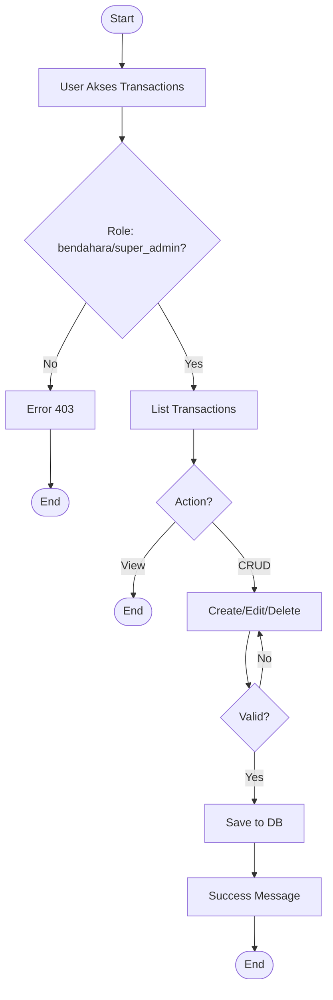
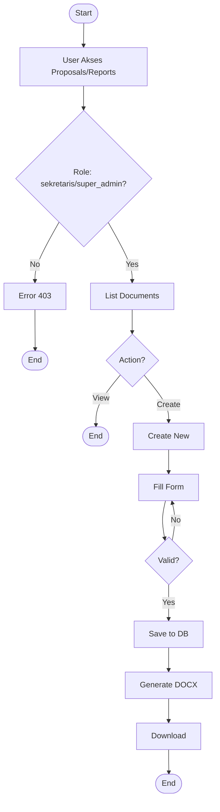
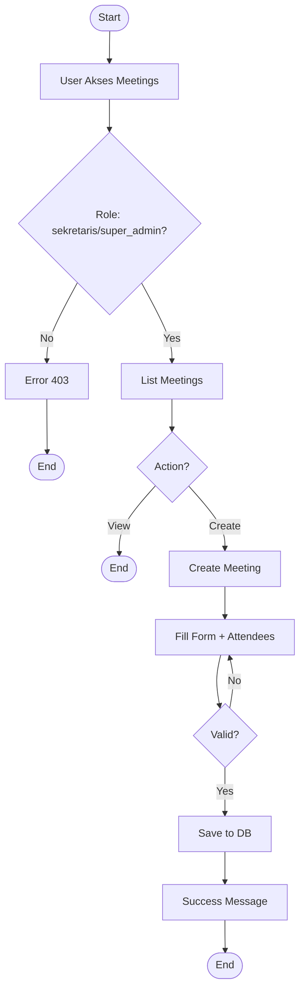
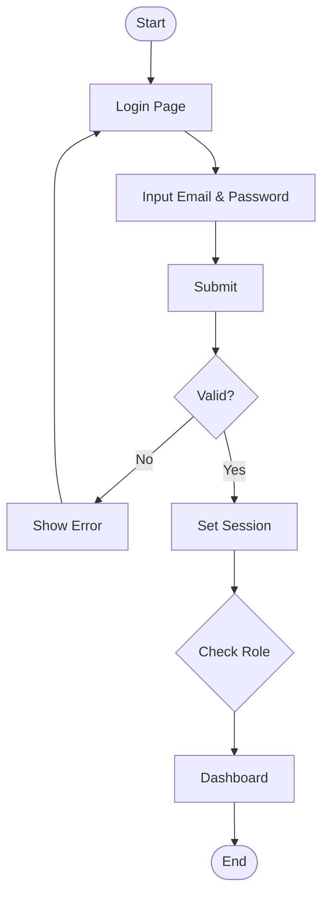

# Sangkara System - Flowchart (PHP Native)

Dokumentasi alur kerja sistem Sangkara dengan arsitektur PHP Native MVC.

## 1. Transaction Management Flow



## 2. Proposal/Report Generation Flow



## 3. Meeting Management Flow



## 4. Authentication Flow



## Legend & Notes

### Client-Side Components:
- **Browser** - User Interface dengan Tailwind CSS + Flowbite
- **JavaScript** - TipTap Editor untuk rich text, Vanilla JS untuk interaktivitas
- **AJAX/Fetch** - Request ke server tanpa reload page (untuk upload, dll)

### Server-Side Components (PHP Native MVC):
- **Router** - Custom Router class (app/Router.php) dengan pattern matching
- **Controllers** - Custom PHP Controllers (app/Controllers/)
  - UserController, TransactionController, MeetingController
  - ProposalController, ReportController, CategoryController
  - DashboardController
- **Models** - Custom PHP Models dengan PDO (app/Models/)
  - User, Transaction, Meeting, Proposal, Report, Category
  - Menggunakan PDO untuk database operations
- **Views** - PHP Template files dengan Tailwind CSS (app/Views/)
  - Layout templates (layout.php, auth.php)
  - Resource views (index, create, edit, show)
- **Services** - Business Logic Services (app/Services/)
  - ProposalGeneratorService - Generate DOCX dari template
  - DocumentConversionService - Convert HTML to DOCX
  - FinancialService - Kalkulasi keuangan
- **Database** - PostgreSQL dengan PDO driver
- **Session** - Native PHP Session untuk authentication
- **Config** - Configuration files (config/*.php)

### External Services:
- **Cloudinary** - Image hosting & CDN (via cloudinary-labs/cloudinary-php)
- **PHPWord** - DOCX generation (via phpoffice/phpword)

### Data Flow Pattern (PHP Native):
1. **Request Flow:**
   ```
   Browser → public/index.php → Router → Controller → Model → Database
   ```

2. **Response Flow:**
   ```
   Database → Model → Controller → View (PHP Template) → Browser
   ```

3. **File Structure:**
   ```
   /public/index.php          # Entry point
   /app/bootstrap.php         # Bootstrap aplikasi
   /app/Router.php            # Custom router
   /app/Controllers/          # Controllers
   /app/Models/               # Models dengan PDO
   /app/Views/                # PHP views
   /app/Services/             # Business logic
   /config/                   # Configuration files
   /routes/web.php            # Route definitions
   /storage/                  # File storage
   ```

4. **Authentication:**
   - Session-based authentication
   - Password hashing dengan `password_hash()` dan `password_verify()`
   - Role-based access control (super_admin, bendahara, sekretaris, panel_user)

5. **CLI Commands:**
   - `./sangkara serve` - Start PHP dev server
   - `./sangkara migrate` - Run migrations
   - `./sangkara seed` - Seed database
   - `./sangkara make:controller` - Generate controller
   - `./sangkara make:model` - Generate model
   - `./sangkara routes` - List all routes

### Advantages of PHP Native Approach:
- ✅ Lightweight - No framework overhead
- ✅ Full control - Custom implementation sesuai kebutuhan
- ✅ Fast performance - Minimal dependencies
- ✅ Easy deployment - No composer require Laravel/Filament
- ✅ Learning-friendly - Understand PHP fundamentals

### Future Enhancements:
- 🔄 Redis Queue untuk async document generation
- 🔄 API endpoints untuk mobile app
- 🔄 WebSocket untuk real-time notifications
- 🔄 Caching layer untuk performance optimization

